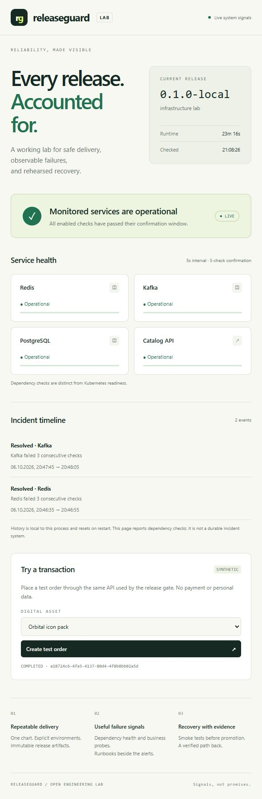

# ReleaseGuard

[](https://github.com/Astro1ot/releaseguard/actions/workflows/verify.yml)

**Safe releases. Observable failures. Rehearsed recovery.**

ReleaseGuard is an open DevOps portfolio lab built around a small digital goods marketplace. It demonstrates the path from a container image to a verified release, including business smoke tests, Helm rollback, PostgreSQL migrations, a transactional outbox, Redis fallback and automated status signals.

This is a lab with explicit boundaries, not a claim of production experience or production readiness. There are no payments, customer accounts, real digital goods or personal data.

## Guided demonstration

On Windows, start Docker Desktop and double-click **Start-Lab.cmd**. On other systems run `python scripts/presenter.py`. The local console at **http://127.0.0.1:8877** runs the actual integration checks and failure drills through buttons, streams their output and records results. Start the stack first, then run one scenario at a time.

The console binds only to loopback, requires a per-session token and a same-origin request for commands, rejects unknown hosts, and exposes only a fixed command allowlist. It is not included in the application Docker image. `Stop` preserves database data. Kubernetes preparation/rehearsal uses only the dedicated `releaseguard` kind cluster and `rg-local` namespace.

For Kubernetes install kind 0.30, Helm 3.19 and kubectl on PATH (or place their binaries in the ignored `.tools/` folder). The local prepared copy already includes kind and Helm; those binaries are intentionally excluded from the source archive.



## Start in five minutes

Requires Node.js 22+ and Python 3.11+. From the repository root:

```sh
npm ci
npm run build
npm run demo
```

Open **http://127.0.0.1:3000**. In another terminal:

```sh
python cli/rg.py smoke
npm test
python -m unittest discover -s tests -v
```

Demo mode uses in-memory orders and immediate fulfillment. PostgreSQL, Redis and Kafka are explicitly shown as disabled. It demonstrates the interface and HTTP contract, not infrastructure resilience. Orders disappear on restart. Stop this process before starting Compose on the same port.

## Full infrastructure lab

Requires Docker Engine with Compose v2. Budget approximately 4–6 GB of available memory for the whole local stack. On Windows use Docker Desktop with Linux containers.

```sh
python cli/rg.py init-env
docker compose up -d --build --wait --wait-timeout 240
python scripts/integration.py
```

`init-env` creates random local credentials and refuses to overwrite existing credentials. They remain in the ignored `.env` file.

| Address | Purpose |
|---|---|
| http://127.0.0.1:8080 | Public edge, rate-limited API and status UI |
| http://127.0.0.1:3000 | Direct API for diagnostics and release tests |
| http://127.0.0.1:3001 | Grafana: `admin`, password from `.env` |
| http://127.0.0.1:9090 | Prometheus |
| http://127.0.0.1:9093 | Alertmanager; local receiver, no external messages |

All published ports bind to loopback. The full lab contains PostgreSQL, Redis, a single Kafka broker, NestJS API, Nginx, Prometheus, Alertmanager and Grafana. PostgreSQL data persists in a volume; Kafka in this lab is intentionally ephemeral. Start from a fresh lab when changing broker state or replaying destructive infrastructure experiments.

## Demonstrations with evidence

Run these against the **full Compose lab**:

```sh
python scripts/drill.py redis
python scripts/drill.py kafka
python scripts/drill.py rate-limit
python scripts/migration_drill.py
python scripts/load.py --requests 1000 --concurrency 20
```

- **Redis unavailable:** the catalog falls back to PostgreSQL, concurrent misses coalesce per process, readiness stays up, and the incident resolves after recovery.
- **Kafka unavailable:** orders remain durable and pending; the outbox publishes after recovery and the consumer completes them idempotently.
- **Traffic burst:** the edge returns both successful responses and `429`, without turning client throttling into API failures.
- **PostgreSQL migration:** a deliberately held lock makes DDL fail fast, then an additive column and concurrent index are applied while orders are written.
- **Bad release:** the Kubernetes rehearsal deploys a catalog regression, fails the business check, rolls back to the recorded revision and verifies recovery.

Scripts write measured JSON results under ignored `artifacts/`. Do not present demo-mode throughput as PostgreSQL/Kafka or production throughput. Failed drills return nonzero; dependency drills restart stopped services in `finally`.

## Kubernetes and rollback

Use **Helm 3.19**, kubectl, kind and Docker. The CLI always requires an explicit context and namespace.

```sh
kind create cluster --name releaseguard --config infra/kind.yaml
docker build -t releaseguard:local .
kind load docker-image releaseguard:local --name releaseguard
python cli/rg.py bootstrap --context kind-releaseguard --namespace rg-local
python cli/rg.py plan --context kind-releaseguard --namespace rg-local --environment local
helm upgrade --install releaseguard charts/releaseguard -f environments/local.yaml --namespace rg-local --kube-context kind-releaseguard --wait --timeout 300s
python scripts/kube_rehearsal.py --context kind-releaseguard --namespace rg-local
```

The rehearsal checks its own result: a failed release must still return exit code 1 even after successful rollback. Its evidence includes the exact previous revision and whether the recovery smoke passed. A first install has no previous revision; the CLI reports that explicitly.

For two environments, bootstrap `rg-staging` separately and render `environments/staging.yaml`. Secrets and dependencies are namespace-local. The application chart is the same. Render before applying; `values.schema.json` rejects unknown keys and `latest` tags.

The local kind CNI does **not** enforce NetworkPolicy. Install a policy-capable CNI before claiming isolation testing. The manifests define ingress isolation, not comprehensive egress isolation. Read [architecture and limits](docs/architecture.md) before hosting.

## CI and publication

- `Verify`: reusable workflows for unit tests, chart checks, Compose integration/drills and a real Kubernetes rollback rehearsal on pushes and pull requests.
- `Kubernetes rollback rehearsal`: also available manually; creates an isolated kind cluster and collects rollback evidence.
- `Publish image`: manual workflow; runs verification first, publishes a commit-tagged image to GHCR with provenance/SBOM.

The release gate runs through `python cli/rg.py deploy`. GitHub workflows deliberately contain no production kubeconfig or unattended production deployment.

See [publication guide](docs/publishing.md), [demo script](docs/demo-script.md), [verification record](docs/verification.md) and [roadmap](docs/roadmap.md).

## Design choices worth discussing

| Decision | Reason / tradeoff |
|---|---|
| Business smoke after Helm readiness | A pod can be ready while catalog or fulfillment is broken |
| Readiness excludes downstream health | Partial dependency failures must not remove every API endpoint |
| Order and outbox event commit together | No acknowledged order is lost between DB commit and publish |
| Consumer deduplication inside its DB transaction | At-least-once delivery does not repeat the business effect |
| Local single-flight plus short cache TTL | Bounds origin load per pod when Redis is unavailable; not a distributed lock |
| Additive schema changes before contract | Application rollback cannot reverse a destructive database migration |
| Three-check status confirmation with 20-second expiry | Reduces flapping and rejects stale green observations; history remains process-local in v0.1 |

## Repository map

```text
src/                 NestJS API, cache, outbox, consumer, status logic
public/              Accessible status page with a synthetic transaction
cli/                 Python release gate, runner and Vault API example
charts/releaseguard/  Shared Helm chart + strict values schema
environments/        Local and staging overlays
migrations/          Checksummed PostgreSQL migrations
observability/       Prometheus rules and provisioned Grafana dashboard
scripts/             Failure drills, integration checks and load reporting
tests/               Release-gate failure-path tests
docs/                Architecture, runbooks and honest verification record
```

License: [MIT](LICENSE). Independent educational project; not affiliated with Playerok.

Orders now persist their recovery key across browser reloads and use a separate read-only status check. Invalid Kafka deliveries are quarantined before offsets advance; `python scripts/broker_contract.py` checks this against the real lab.
