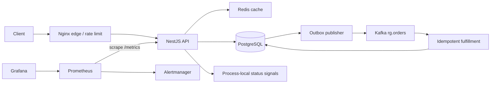

# Architecture and operating boundaries

The publisher and consumer run inside each API process in v0.1. PostgreSQL `SKIP LOCKED` assigns outbox batches across replicas. Kafka group membership distributes partitions across the consumers. Separating workers is a planned next step, not already implemented.

## Order correctness

1. Validate the product and idempotency key.
2. Insert the order and outbox event in one transaction. A unique constraint serializes concurrent attempts using the same key. Reusing a key for a different product returns `409`.
3. Publish the outbox event with its stable UUID as the Kafka message key.
4. A crash between publication and marking the outbox row creates a duplicate delivery. This is expected.
5. The consumer inserts the event ID and updates the order in one transaction. Duplicate IDs skip the business effect. Kafka offsets are committed only after the handler finishes.

This is at-least-once transport with an idempotent DB effect, not an assertion of end-to-end exactly-once delivery. Public callers are not authenticated in this synthetic lab; there are no private orders. A real marketplace must scope idempotency keys and order access by authenticated account.

## Health and status

- `/health/live`: process serves HTTP.
- `/health/ready`: process accepts work and is not draining. Initial schema migrations finish before the Kubernetes container starts.
- `/api/status`: synthetic catalog check and individual dependency checks every five seconds. Three failures confirm degradation; three successes confirm recovery.
- `/metrics`: business request counts/latency, dependency availability, queue backlog and cache fallback.

Catalog probes generate a small amount of business traffic; their contribution is intentional and must be accounted for in low-traffic dashboards. Dependency probes are not a comprehensive business SLO. Order fulfillment is checked by the release gate.

The status backend is co-located with the application. If the whole app is down, the browser marks the feed stale; it cannot serve an independent outage page. Incidents are in-memory and may differ between replicas. Deploy one API replica for a deterministic local demo. Durable shared history and an independently hosted monitor are v0.2 work.

## Cache limits

Redis commands have deadlines, the offline queue is disabled, and failed commands are not retried per request. Reconnect delay is bounded and jittered. A per-process promise coalesces concurrent misses. A three-second local cache bounds origin requests even with Redis unavailable. Redis TTL has jitter.

This is not cross-replica coalescing: origin load can still scale with replica count. Product data in the lab is static; a mutable catalog needs explicit invalidation and a defined stale-data policy.

## Releases and migrations

The CLI finds the currently deployed Helm revision, never guesses it from the latest history number. Helm readiness handles infrastructure failures. Business smoke checks catalog, idempotency and fulfillment after the rollout. Failure restores the recorded revision, rechecks the business path and leaves the pipeline failed.

Migration checksums detect edits to already applied files. A PostgreSQL advisory lock serializes migration runners, including multiple init containers. DDL uses `lock_timeout`; concurrent index creation is outside transactions. A failed concurrent index must be inspected and repaired explicitly.

There is no automatic down migration. Application rollback assumes backward-compatible schema expansion. Destructive contract changes need a separate release after the rollback window and data validation.

## Security boundaries

- Compose publishes only on loopback; DB, Redis and Kafka have no host ports.
- Edge rejects metrics and health paths, including case/trailing slash variants; API routes are throttled.
- Application and edge containers drop capabilities and run without root in Kubernetes. Dependency images retain their upstream defaults: lab fixtures, not hardened production services.
- Kubernetes secrets are supplied before Helm; plaintext values are never embedded in values files.
- No service account token is mounted in application pods.
- NetworkPolicy allows same-namespace callers to the API. Dependencies accept app/dependency pods. Enforcement requires a suitable CNI.
- Behind a load balancer or ingress, Nginx sees the proxy source IP. Configure real-IP handling only for a verified trusted proxy CIDR, or enforce per-IP policy at that ingress. Never blindly trust arbitrary `X-Forwarded-For`.
- TLS, DNS-01 and external secret management are not installed by default. An existing TLS secret may be referenced by ingress. There is no claim of implemented certificate renewal automation.

## Lab tradeoffs

Single broker, no Kafka persistence, no backup automation, no HA database, no authentication, no payment flow, no autoscaling, no distributed tracing. Broker loss after an outbox row is marked published is outside this lab's durability guarantee. Add replicated/persistent Kafka and reconciliation before using this pattern for real transactions.

Outbox and deduplication tables grow without automated retention; synthetic traffic is bounded. Current charts use pinned tags, not locked image digests. GHCR release images are commit-tagged; registry immutability must be enforced by policy in a production setup.

Primary references: [Kubernetes probes](https://kubernetes.io/docs/concepts/workloads/pods/probes/), [Helm upgrade](https://helm.sh/docs/helm/helm_upgrade/), [PostgreSQL CREATE INDEX](https://www.postgresql.org/docs/17/sql-createindex.html), [KafkaJS consuming](https://kafka.js.org/docs/consuming), [ioredis options](https://github.com/redis/ioredis).
